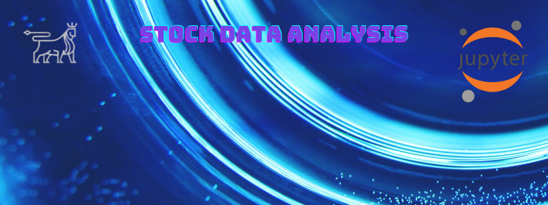

# StocksDataAnalysis

Stock Data Analysis and Data Visualization with pandas, matplotlib, NumPy, seaborn. Manipulate stock data and calculate multiple daily returns. Normalize stocks and create TVM multiples.
